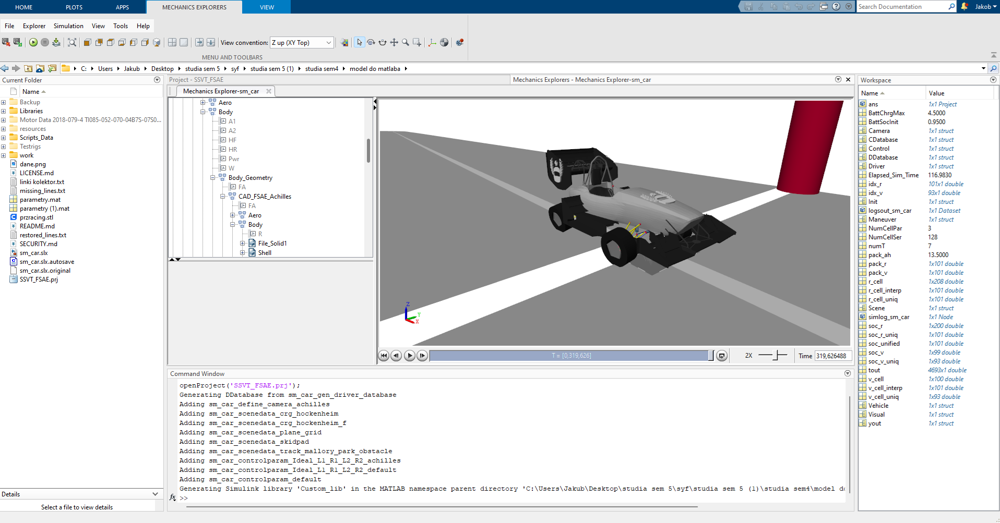
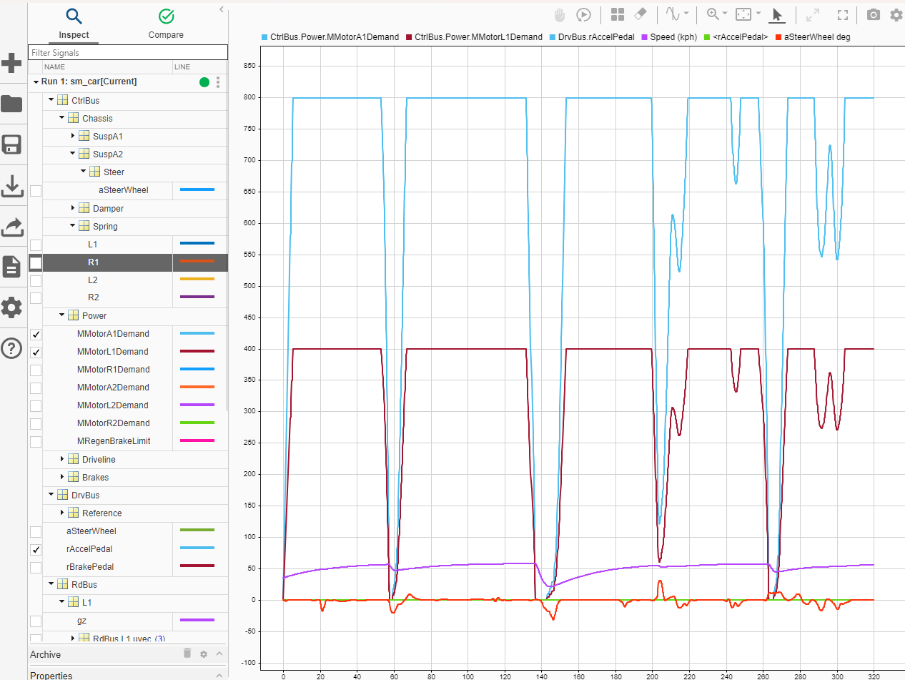

# PMT07 Simscape Vehicle Model

MATLAB/Simscape multibody simulation model for the PMT07 FSAE race car. This project is a fork and adaptation of the official MathWorks Simscape Vehicle Templates, tailored specifically for the PMT07 vehicle dynamics and powertrain architecture.

## Overview

This repository contains a full vehicle dynamics and powertrain model built in Simulink and Simscape. It allows for the simulation of various maneuvers (like skidpad, acceleration, and track driving) while logging critical physical parameters.

### Custom PMT07 Features Incorporated:
*   **Chassis & Aerodynamics:** Custom mass (290 kg), center of gravity positioning, inertia, and aerodynamic coefficients.
*   **Braking System:** Detailed hydraulic brake system modeling, including custom master/caliper cylinder bores, effective radii, and brake proportioning.
*   **Powertrain & Battery:** Custom battery pack parameters mapped to a 101x7 SOC/Temperature grid to resolve dimension constraints in the Simscape `batteryecm` block.
*   *(Optional/WIP)* **Motors:** Integration of Fischer TI085 PMSM torque-speed and efficiency maps into the generic motor and drive blocks.

## Screenshots

### 3D Mechanics Explorer


### Simulink Data Inspector (Telemetry)


## Prerequisites

To run this model, you will need:
*   MATLAB (R2024b or newer recommended)
*   Simulink
*   Simscape
*   Simscape Multibody
*   Simscape Driveline / Electrical

## How to Run

1. Clone this repository to your local machine.
2. Open MATLAB and navigate to the repository folder.
3. Double-click the **`SSVT_FSAE.prj`** file to load the MATLAB Project. This will automatically set up all necessary relative paths.
4. In the MATLAB Command Window, run the initialization script:
   ```matlab
   startup_sm_car
   ```
5. Once the workspace variables are loaded, open the main Simulink model **`sm_car.slx`**.
6. Click the **Run** button in Simulink to start the simulation.

## Customizing for Future Cars

This project is built using a script-based initialization architecture. To update the simulation parameters for a new vehicle, **do not manually edit the Simulink block masks**. Instead, modify the `.m` scripts and data files.

1. **Chassis & Physics:** 
   Modify `Scripts_Data\Data_Vehicle\Vehicle_data_dwishbone.m` to update mass, inertia, CG, brakes, suspension geometry, and aerodynamics.
2. **Battery Parameters:** 
   Update or replace `PMT07.m` with your new battery cell characterization, or modify the default scripts `Vehicle_data_Battery_Cell.m` and `Vehicle_data_Battery_Pack.m`.
3. **Tires:** 
   Provide a new Pacejka Magic Formula (`.tir`) file in `Libraries\Vehicle\Body\Tires\` and update the Tire block references if you switch tire manufacturers.
4. **3D Visuals (CAD):** 
   To update the car's visual representation in the Mechanics Explorer, export your new frame/body as `.STL` files. Replace the existing files in `Libraries\Vehicle\Body\CAD\FSAE_Achilles\Parts\` with your new meshes, keeping the exact same file names.

## Analyzing Data

*   Use the **Mechanics Explorer** window that pops up to view the 3D animation of the car during the maneuver.
*   Click the **Data Inspector** icon in Simulink to view detailed telemetry logs (currents, voltages, wheel slip, suspension travel, etc.) after the simulation finishes.

---
*Based on the MathWorks Virtual Vehicle Template.*
